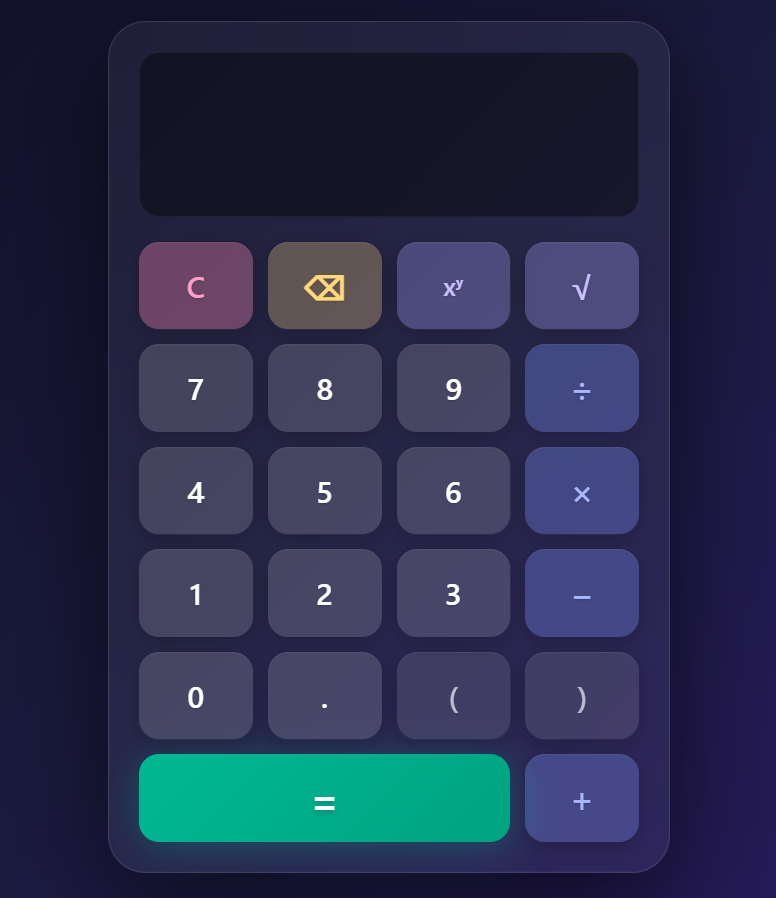

# Sishulator

A modern calculator web application with support for:
- Basic arithmetic operations 
- Exponentiation 
- Square root



## Features

- **Basic Operations**: Addition, subtraction, multiplication, and division
- **Advanced Functions**: Exponentiation (xʸ) and square root (√)
- **Parentheses Support**: For complex expressions
- **Error Handling**: Detects and displays errors for invalid operations (division by zero, negative square roots)
- **Keyboard Support**: Full keyboard navigation
- **Undo Functionality**: Backspace to remove last character
- **Responsive Design**: Works on all screen sizes
- **Modern UI**: Glass-morphism design with smooth animations


## Technologies Used

- HTML5
- CSS3 (Custom properties, Grid, Flexbox, Animations)
- Vanilla JavaScript (ES6 Classes, Tokenization, Shunting-yard algorithm)

## Installation

1. Clone the repository:
```bash
git clone https://github.com/kasra-git/Sishulator.git
```
2. Run HTML file in any browser
